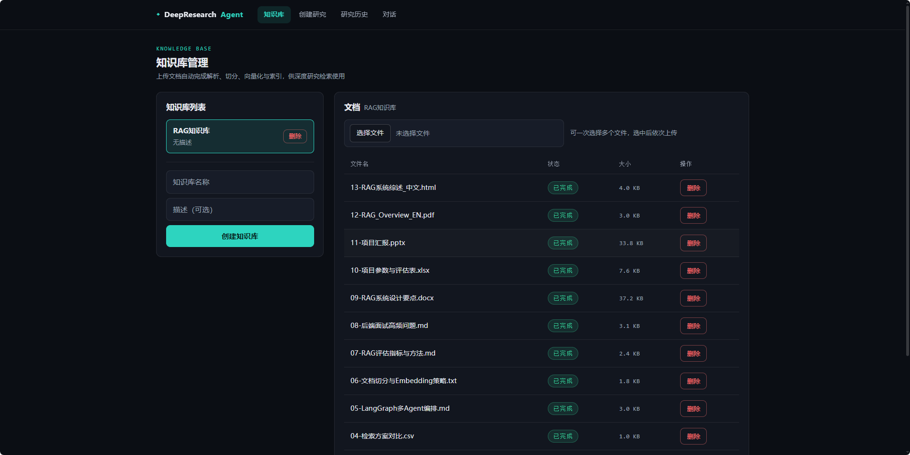
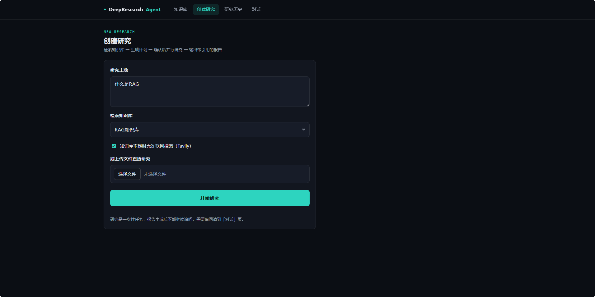
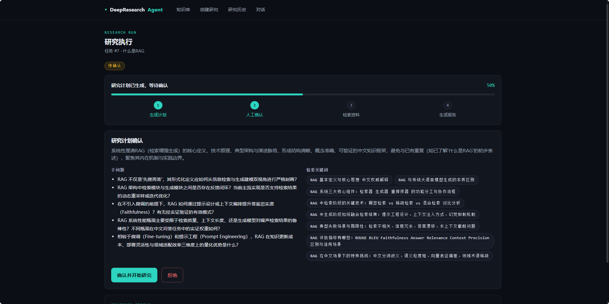
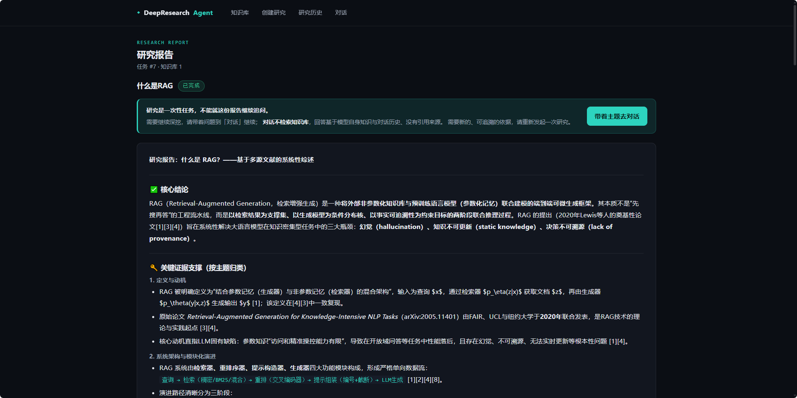
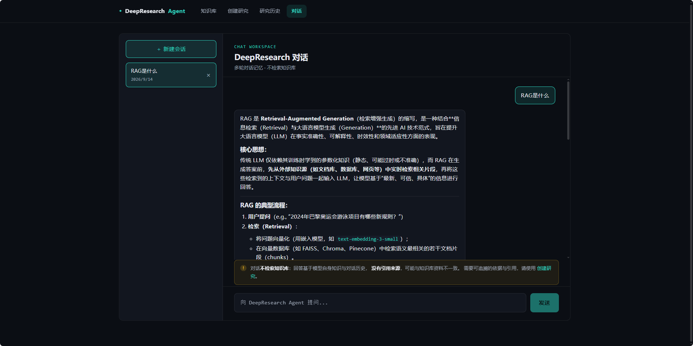
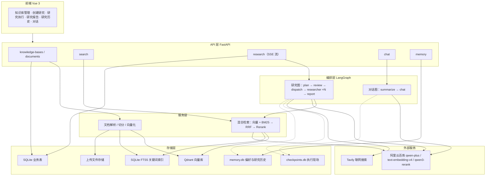

# DeepResearch Agent

基于 **RAG + LangGraph** 的智能深度研究助手：上传文档建立知识库，输入研究主题后自动规划、人工确认计划、混合检索（向量 + BM25 + 重排）、必要时联网补充，最终生成带引用来源的中文研究报告。另有独立的多轮对话与长期记忆模块。

## 功能特性

- **知识库管理**：上传 PDF / Markdown / TXT / Word / Excel / PPT / CSV / HTML 文档，自动完成解析 → 切分 → 向量化 → 入库，实时查看文档处理状态；支持一次选择多份文件批量上传
- **混合检索**：向量检索（Qdrant）+ 关键词检索（SQLite FTS5 BM25）双路召回，RRF 排名融合
- **Rerank 精排**：接入百炼 `qwen3-rerank` 交叉编码器，对召回候选重新打分
- **研究编排（LangGraph 多 Agent）**：规划 → 人工确认 → Send API 并行分发子问题给多个研究员 Agent → 聚合生成报告
- **Human-in-the-loop**：研究计划生成后暂停，由用户确认或拒绝后才继续执行
- **联网补充**：子 Agent 证据不足时（按开关）调用 Tavily 搜索，结果带 URL 引用
- **SSE 流式进度**：研究执行过程实时推送进度事件，前端逐步展示；检索阶段耗时最长也不会"卡住不动"
- **多轮对话与长期记忆**：会话内多轮记忆（超长时自动压缩为摘要），跨会话保存用户偏好与研究历史。**对话不检索知识库**，它面向快速澄清，需要可追溯的依据时走研究流程
- **前端（Vue 3）**：知识库管理、创建研究、研究执行、研究报告、研究历史、对话六个页面，统一暗色主题

## 截图

| 页面 | 截图 |
|------|------|
| 知识库管理（批量上传、处理状态与大小） |  |
| 创建研究（选择知识库、按需开启联网） |  |
| 研究执行（计划确认 + SSE 实时进度） |  |
| 研究报告（Markdown 渲染 + 引用来源 + Token 统计） |  |
| 对话（多轮记忆，不检索知识库） |  |

## 架构



**研究主流程（多 Agent）**：

```text
用户输入主题
  → plan 节点：LLM 生成研究计划（子问题 + 检索关键词）
  → review 节点：interrupt 暂停，等待用户确认计划
  → dispatch 节点：Send API 把每个子问题并行分发给独立研究员 Agent
      ├─ researcher(子问题1)：混合检索（向量 + BM25 + RRF + Rerank）→ 生成子回答
      ├─ researcher(子问题2)：同上
      └─ researcher(子问题N)：同上
        └─ 证据不足且开启联网 → 子 Agent 内 Tavily 补充
  → report 节点：聚合所有子回答与证据，生成带引用编号的中文报告
```

## 技术栈

| 层 | 技术 |
|----|------|
| 后端 | Python 3.10+、FastAPI、SQLAlchemy 2.x（async）、Pydantic v2 |
| Agent | LangChain、LangGraph（StateGraph + interrupt + checkpoint + Send API 多 Agent） |
| 记忆 | LangGraph 持久化 checkpointer（会话内）+ AsyncSqliteStore（跨会话偏好/历史） |
| 检索 | Qdrant（向量）、SQLite FTS5（BM25）、RRF 融合、qwen3-rerank |
| 模型 | 阿里云百炼（qwen-plus / text-embedding-v4 / qwen3-rerank）、Tavily |
| 前端 | Vue 3 + Vite + vue-router + marked |

## 快速开始

### 1. 环境准备

```bash
# 克隆项目
git clone https://github.com/beixiao66/deepresearch-agent.git
cd deepresearch-agent

# Python 虚拟环境（Python 3.10-3.13）
python3.10 -m venv .venv
# Windows:
.venv\Scripts\activate
# macOS/Linux:
source .venv/bin/activate

# 安装依赖
pip install -r requirements.txt

# 前端依赖
cd frontend
npm install
cd ..
```

### 2. 配置环境变量

```bash
cp .env.example .env
# 填入：
# DASHSCOPE_API_KEY=你的百炼 API Key（阿里云百炼控制台）
# TAVILY_API_KEY=你的 Tavily API Key（https://tavily.com）
```

### 3. 启动基础设施

```bash
# 启动 Qdrant 向量库（Docker）
docker compose up -d
```

### 4. 启动后端

```bash
# 项目根目录执行（.env 在根目录），开发期建议带 --reload
uvicorn app.main:app --port 8000 --reload
# 健康检查：http://127.0.0.1:8000/health
# API 文档：http://127.0.0.1:8000/docs
```

### 5. 启动前端

```bash
cd frontend
npm run dev
# 浏览器打开 http://127.0.0.1:8080
```

### 使用流程

1. **知识库页**：创建知识库 → 上传文档（PDF/MD/TXT/DOCX/HTML/XLSX/PPTX/CSV，可多选批量上传），等待状态变为"已完成"
2. **创建研究页**：输入研究主题、选择知识库、可选开启联网
3. **执行页**：查看生成的计划（子问题 + 关键词）→ 确认或拒绝 → 实时看 SSE 进度
4. **报告页**：阅读 Markdown 报告（含引用编号）；研究是一次性任务，需要追问可跳到对话页

## API 概览

| 方法 | 路径 | 说明 |
|------|------|------|
| POST | `/api/v1/knowledge-bases` | 创建知识库 |
| GET | `/api/v1/knowledge-bases` | 知识库列表 |
| DELETE | `/api/v1/knowledge-bases/{id}` | 删除知识库（级联清理文档与向量） |
| POST | `/api/v1/knowledge-bases/{id}/documents` | 上传文档（自动索引，单次一个文件） |
| GET | `/api/v1/knowledge-bases/{id}/documents` | 文档列表（含状态） |
| DELETE | `/api/v1/knowledge-bases/{id}/documents/{doc_id}` | 删除文档（同步清理三处存储） |
| POST | `/api/v1/knowledge-bases/{id}/search` | 向量检索 |
| POST | `/api/v1/research` | 创建研究（SSE 流，到计划确认暂停） |
| POST | `/api/v1/research/tasks/{id}/approve` | 确认/拒绝计划（SSE 流，恢复执行） |
| GET | `/api/v1/research/tasks` | 研究任务列表 |
| GET | `/api/v1/research/tasks/{id}` | 任务详情（状态/计划/报告） |
| POST | `/api/v1/chat` | 多轮对话 |
| GET | `/api/v1/chat/conversations` | 会话列表 |
| GET | `/api/v1/chat/conversations/{id}/messages` | 会话消息恢复 |
| DELETE | `/api/v1/chat/conversations/{id}` | 删除会话及其对话历史 |
| GET/PUT | `/api/v1/memory/preferences` | 读取/更新报告偏好（风格与语言） |

## 评估结果

基于自建同主题多文档语料（`RAG评估语料库`，10 份文档覆盖 RAG / LangGraph / 向量数据库三个主题，MD/TXT/PDF 三种格式）的离线评估（`scripts/evaluate_rag_v3.py`，25 条测试问题，含文档级 + 片段级双金标）：

| 检索方式 | DocR@5 | ChunkR@5 | DocMRR | ChunkMRR |
|----------|--------|----------|--------|----------|
| 纯向量 | 0.960 | 0.960 | 0.877 | 0.814 |
| 混合（向量+BM25+RRF） | 0.960 | 0.960 | 0.877 | 0.814 |
| 混合+Rerank | **1.000** | **1.000** | **0.968** | **0.968** |

> 说明：
> - 片段级金标（锚定词必须出现在检索片段中）成功拉开三档差距：Rerank 在 ChunkMRR 上比纯向量提升 0.154
> - 纯向量与混合检索指标一致，源于 SQLite FTS5 默认 tokenizer 对中文分词效果差，BM25 路对中文查询几乎无增益，需自定义中文分词 tokenizer（见已知局限）
> - 语料与评估脚本可重新生成：`scripts/generate_eval_corpus.py`；另有 `scripts/generate_kb_docs.py` 可一次生成覆盖全部支持格式的测试语料

## 测试

```bash
# 后端（187 个测试，全部 mock，不消耗真实 API）
pytest -q
```

覆盖：文档解析（PDF/MD/TXT/DOCX/HTML/XLSX/PPTX/CSV）/切分/Embedding 分批、FTS5 索引与检索、RRF 融合、Rerank、混合检索、DocumentService 状态流转、研究任务持久化、HITL 两阶段流程、SSE 事件格式与实时推送、chat 图与会话管理、长期记忆读写、API 校验与错误处理。

## 已知局限

- **FTS5 中文分词**：SQLite FTS5 默认 tokenizer 对中文处理一般，导致混合检索中 BM25 路对中文查询增益有限（评估数据显示混合与纯向量指标一致）；已调研 jieba 分词预处理方案，需重建 FTS5 索引
- **切分粒度**：使用 `RecursiveCharacterTextSplitter` 的默认分隔符（面向英文设计），中文长段落会退化为按字符硬切，可能切在词中间；`chunk_size=500` 是字符数而非 token 数
- **没有相关性阈值**：检索链路只做"排序 + Top-K 截断"，未设分数下限，因此知识库中存在文档时必然返回结果，主题不相关时低分片段也会进入上下文
- **扫描件 OCR**：扫描版 PDF / 图片类型文档需 OCR 后才能检索，当前版本不支持
- **XLSX/PPTX 提取深度**：XLSX 仅提取单元格文本（公式结果按 `data_only` 读取），PPTX 仅提取文本框内容，图表、嵌入对象和图片内文字暂不提取；PDF 提取保留硬换行，未做文本清洗
- **任务状态持久化**：`research_tasks` 表结构变更需手动 ALTER TABLE（SQLite 无自动迁移）
- **在线部署**：尚未部署到线上环境（本地运行验证通过）

## 项目结构

```text
deepresearch-agent/
├── app/
│   ├── api/routes/          # 路由层（chat/memory/research/knowledge_base/documents/search）
│   ├── core/                # 配置、异常处理
│   ├── db/                  # 数据库会话、初始化与轻量迁移
│   ├── models/              # SQLAlchemy 模型（知识库、文档、研究任务、会话）
│   ├── repositories/        # 数据访问层
│   ├── schemas/             # Pydantic 模型
│   └── services/            # 业务层
│       ├── research_graph.py    # LangGraph 多 Agent 主图
│       ├── chat_graph.py        # 多轮对话图（含摘要压缩）
│       ├── memory_store.py      # 长期记忆（偏好 / 研究历史）
│       ├── document_retriever.py # 混合检索
│       ├── reranker.py          # qwen3-rerank 重排
│       ├── sparse_*.py          # FTS5 关键词检索
│       ├── sse.py               # SSE 事件流
│       └── web_search.py        # Tavily 联网
├── frontend/                # Vue 3 前端（6 个页面）
├── scripts/                 # 评估脚本与语料生成
├── tests/                   # 187 个后端测试
├── compose.yaml             # Qdrant Docker 编排
└── requirements.txt
```
